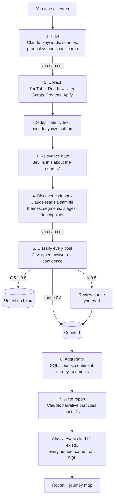

# Architecture

## 1. The pipeline for one search



**Division of labour**

| Tool | Does | Why |
|---|---|---|
| **Claude** (via Vercel AI Gateway) | Plans the search, proposes the codebook, writes the narrative | Needs language generation. Runs a few times per search, not per post |
| **Jev** (`typesafe-ai/jev` via Vercel AI Gateway) | Every per-post decision: relevance, sentiment, stage, segment, themes, touchpoints | Typed answers + calibrated confidence. $0.042 per million input tokens, so it's cheap enough to run on every post |
| **SQL** | Every number | Numbers must be reproducible |
| **You** | Edit the plan and codebook, clear the review queue, spot-check | Same role as the hand-verdict files, much less volume |

## 2. Saved searches (the "live" part)

A saved search re-runs daily with the **same codebook version**:
collect new posts only → relevance → classify → aggregate. The narrative is
rewritten only when something changes significantly (to save Claude cost).
Changing the codebook creates a new version, and the report says the base
moved.

## 3. Tech stack

| Concern | Choice | Why |
|---|---|---|
| App | Next.js (App Router, TypeScript) on Vercel | One codebase for UI and backend. You already use Vercel |
| AI | Vercel AI SDK + AI Gateway (`AI_GATEWAY_API_KEY`) | One key and one bill for Claude and Jev. Spend is visible in the gateway |
| Database | Postgres (Neon free tier via Vercel) + Drizzle ORM | Free at this scale. SQL for every number |
| Background jobs | Job table + resumable steps (Vercel Workflow, or cron + queue) | Scraping and Jev runs take minutes, longer than one request |
| Jev rate limit | A queue with concurrency 2 and retry on 429 | Gateway returns 429 above 2 |
| Access | Single passcode (env var) in middleware | Only you use it for now |
| Charts | SVG/React components following the dataviz rules | Journey map is custom |
| Tests | Vitest (unit), Playwright (UI) | |

Environment variables (names reused from the earlier project):
`AI_GATEWAY_API_KEY`, `YOUTUBE_API_KEY`, `SCRAPECREATORS_API_KEY`,
`SCRAPECREATORS_USD_PER_CREDIT`, `APIFY_TOKEN`, `APIFY_AMAZON_ACTOR`, `DATABASE_URL`, `PULSE_PASSCODE`, `AUTHOR_HASH_SALT`.

## 4. Data model (first cut)

```
search(id, query, kind[product|family|category|audience], regions[], created_at)
plan(search_id, version, keywords, sources, exclusions)
post(id, source, source_id, url, author_hash, posted_at, title, text,
     text_hash, rating, lang, region, collected_at, search_id)
codebook(search_id, version, stages[], segments[], themes[], touchpoints[],
         each with {key, label, definition, examples})
decision(post_id, codebook_version, question, answer, confidence,
         model, created_at)               -- one row per Jev answer
review(post_id, question, human_answer, reviewed_at)
report(search_id, codebook_version, snapshot_at, narrative_json,
       numbers_json, cost_usd)
cost_event(search_id, provider, units, usd, created_at)
```

## 5. Connectors

A connector has one interface: `collect(plan, since, budget) → Post[]`.
Retail connectors also return **listings** (title, model, SKU/ASIN,
country), which feed the product catalog.

| Phase | Source | Region | Via | Cost |
|---|---|---|---|---|
| 1 | YouTube videos + comments | all | YouTube Data API | Free quota |
| 1 | Reddit posts + comment threads | NA, India | ScrapeCreators (`/v1/reddit/search`, `/v1/reddit/post/comments`) | ~1 credit per call (≈ $0.002) |
| 1b | Amazon.com listings + reviews | NA | Apify actor (after Apify credits are topped up) | Per actor pricing |
| 2 | Best Buy, Walmart, Target, Costco reviews | NA | Apify actors (to verify per retailer) | Credits |
| 2 | Amazon.in, Flipkart | India | Apify actors | Credits |
| 2 | Mercado Libre, Amazon MX/BR | LATAM | Apify actors | Credits |
| 2 | TikTok, Instagram | NA, LATAM, India | ScrapeCreators | Credits |
| 3 | JD.com, Tmall, Xiaohongshu, Bilibili | China | Apify actors (proxy needed, as in the earlier project) | Credits |

Each connector reports its cost estimate *before* a run, and the search
stops at the per-search cap. One source failing never fails the search.

## 6. Product catalog

```
catalog(id, key unique, name, status[draft|approved], approved_at)     -- one per family, shared by searches
catalog_node(id, catalog_id, level[category|family|series|model|sku|service],
             parent_id, name, aliases[], verified, sort, region, retailer_ids[])
search.catalog_id -> catalog                                           -- set null if the catalog is removed
post_product(post_id, node_id, method[listing|jev|review|alias], confidence)
price_observation(node_id, retailer, country, currency, list_price,
                  current_price, observed_at)
price_tier(node_id, country, tier[entry|mid|premium], computed_at)    -- Phase 2
```

- Key: the normalized subject (`familyKey`, e.g. "HP Smart Tank printers" → "hp smart tank"). A search of a family
  that already has a catalog links to it; no AI call.
- Drafting: code counts model-like mentions ("Smart Tank 7301") in the search's posts; Claude turns them plus
  its knowledge into family → series → model with aliases, marking unsure nodes unverified. You review on
  `/products/[id]` (Models tab): rename, add models from mentions the catalog doesn't cover, retire. Its Product
  knowledge tab holds the family's knowledge base (D45; `catalogs.product_facts`, history in `knowledge_runs`).
- Social post → series/model by whole-word name/alias match (method `alias`, `src/lib/catalog.ts`), keeping only
  the most specific hit. Short numbers ("580") and years only count right after a family word. Re-linked when
  the catalog is saved and when a collection run finishes. Counts are SQL over `post_product`.
- Step 5: Jev maps ambiguous posts with the catalog as options (method `jev`).
- Retail review → model/SKU via its listing (method `listing`) once Apify is on.
- Regional names for the same model are aliases of one node, so cross-region comparison works.

## 7. Running on Vercel Hobby

Phase 1: the search page drives collection by calling a server action that works through queued jobs for
about 20 seconds at a time (`src/lib/collect.ts`). Jobs are claimed atomically, retried with delays, capped
by the plan's post limit, and paused by the budget guard. Closing the page pauses the run.


Hobby limits function run time and allows daily cron jobs only. Pulse is
designed to fit:
- The pipeline runs as **small resumable steps**. Each step handles one batch
  (e.g. 20 posts through Jev) and saves progress, so no single call runs long.
- Daily refresh of saved searches fits the Hobby daily cron.
- Apify runs are started, then polled. We never wait inside one request.

If a limit still blocks us (for example step chaining or run time), the
options are Vercel Pro, or GitHub Actions as a free background worker. We
decide when that happens.
