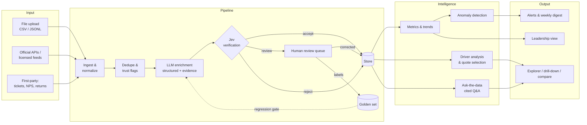

# Architecture

## 1. System overview



Every stage is a separate, testable module with a narrow interface. Each stage
reads and writes the store, so stages can run independently. For example,
you can re-verify with a new Jev version without re-enriching.

## 2. Layers

### 2.1 Input (connectors)
- Interface: `Connector.fetch(since) -> Iterable[RawMention]`.
- MVE: `JsonlConnector`, `CsvConnector`. MVP: 2–3 official/licensed sources
  chosen with the study owner. V1: first-party (Zendesk/Salesforce/NPS exports).
- **Source register** (`studies/*.yaml → sources`) records type, legal basis
  and rate limits.

### 2.2 Normalize
- Maps into the canonical `Mention` (see `src/pulse/schema.py`): stable ID
  = hash(source, source_id); text hash for near-dupes; pseudonymized author;
  rating normalized to 0–1; region/language.
- **Syndication dedupe:** the same review text posted across retailers is
  collapsed to one mention with multiple `seen_at` sources.

### 2.3 Enrichment (LLM)
- Interface: `Enricher.enrich(mention, study) -> Enrichment`.
- `ClaudeEnricher` uses structured outputs (Pydantic schema) so every
  response parses. The system prompt is built from the study config
  (taxonomy, products, journey rules) and is identical across mentions, so
  it is prompt-cached.
- Default model `claude-opus-5`, with server-side refusal fallbacks enabled.
  Effort is configurable per study. We tune it against the golden set, not by
  guessing.
- Backfills of more than a few hundred mentions go through the **Message
  Batches API** (50% cost, async). Daily increments use the normal API.
- `KeywordEnricher` reproduces the old keyword approach. It is the **control**
  in every evaluation and needs no network, so it doubles as an offline test
  double.
- Every record stores `extractor`, `model`, `prompt_version`.

### 2.4 Jev: the verification and decision layer
See [JEV.md](JEV.md). Summary:
1. **Tier 1: deterministic checks** on every record. Evidence quotes exist
   verbatim in the text. Aspects are in the taxonomy. Rating/text divergence.
   Ownership claims are grounded. Coverage.
2. **Tier 2: LLM judge** for records that fail Tier 1, look ambiguous, or
   fall in a random audit sample. An independent pass that re-reads the text
   and agrees, corrects or rejects.
3. **Decision:** `accept`, `review` (human queue) or `reject`, plus a
   confidence score. Only `accept` (and human-corrected) records feed metrics.

The `Verifier` interface lets the existing Jev implementation plug in as-is.

### 2.5 Store
- MVE: SQLite (`pulse.db`), three tables (`mentions`, `enrichments`,
  `verdicts`) with JSON payloads. Upserts are idempotent.
- MVP: Postgres (+ pgvector for semantic search / ask-the-data), object
  storage for raw payloads.

### 2.6 Intelligence
- **Metrics:** volume, NSS = %positive − %negative, aspect NSS, stage NSS,
  product compare, share of voice, rating-vs-text divergence.
- **Anomaly detection:** weekly aspect negative share vs. trailing baseline
  (z-score with minimum volume). MVP adds seasonality-aware baselines.
- **Driver analysis:** which aspects explain the change in NSS between two
  periods (contribution = Δshare × NSS).
- **Evidence selection:** representative, high-confidence quotes per driver.
- **Ask-the-data (V1):** retrieval over verified mentions, with answers that
  must cite mention IDs.

### 2.7 Output
- MVE: static HTML leadership report (`pulse report`).
- MVP: web app (FastAPI + a React/Next front end) with a leadership view,
  explorer, compare, review queue and study admin. Scheduled digest.

## 3. Runtime and deployment (MVP target)

| Concern | Choice | Notes |
|---|---|---|
| Language | Python 3.11 | Pipeline + API |
| API | FastAPI | Read API for the UI |
| UI | Next.js (or a hosted artifact for the leadership page early on) | See DESIGN.md |
| Scheduler | Cron / GitHub Actions → managed workflow (Prefect/Dagster) later | Daily incremental runs |
| DB | Postgres + pgvector | SQLite for local/dev |
| LLM | Claude API (Messages + Batches) | Behind the `Enricher`/`Verifier` interfaces |
| Observability | Structured logs; per-run cost, latency, Jev accept rate | Dashboards in MVP |
| CI | Lint, unit tests, **golden-set regression gate** on prompt/model changes | See EVALUATION.md |

## 4. Data model (abridged)

```
Mention(id, study_id, source, source_id, url, product_id, brand,
        author_hash, verified_purchase, posted_at, rating, rating_norm,
        title, text, language, region, text_hash, ingested_at)

Enrichment(mention_id, extractor, model, prompt_version,
           overall_sentiment, overall_score, aspects[{aspect, sentiment,
           evidence}], journey_stage, ownership_months, ownership_evidence,
           use_case, persona, pain_points[], needs[], touchpoints[],
           intent, competitors[], trust_flags[], summary, created_at)

Verdict(mention_id, verifier, decision, confidence, checks[{name,
        passed, detail}], judge_notes, created_at)
```

## 5. Extensibility: making it "any product, any industry"

Everything study-specific lives in `studies/<study>.yaml`:
products, brands, competitors, regions, languages, sources, **aspect
taxonomy** (with descriptions and example phrases), journey rules and alert
thresholds. A new industry means writing a new YAML file. We plan to ship
taxonomy templates (hardware device, SaaS app, CPG, hospitality, automotive)
that an LLM can draft from a product description and an analyst then
approves.
